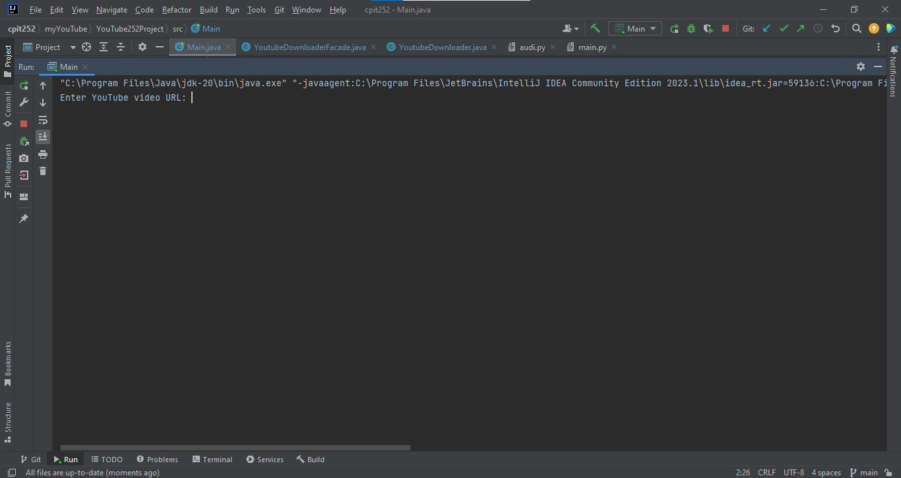
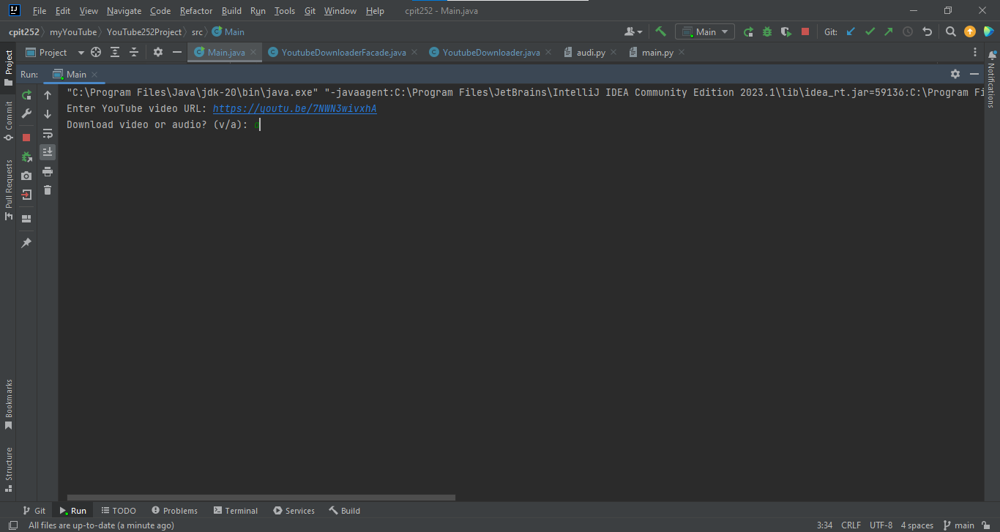
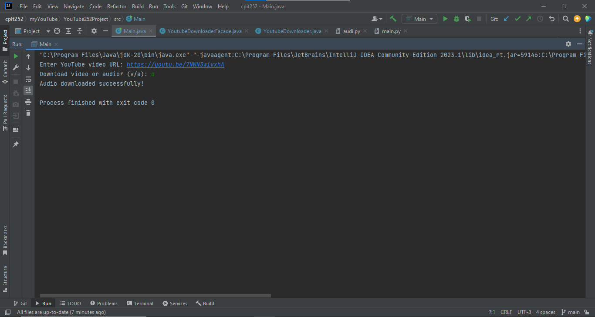

YouTube Downloader
This is a Java program that allows you to download videos and audio from YouTube using a simple command-line interface. The program uses the ProcessBuilder class to start external processes that execute Python scripts to download the videos and audio.
This Java program implement two design patterns Singelton and Facade 

Prerequisites
Before using this program, you must have the following installed on your system:

Java Development Kit (JDK) version 8 or higher
Python version 3.6 or higher
moviepy library
Pytube library


Getting Started
To use this program, follow these steps:

Clone this repository to your local machine.
Navigate to the src directory.
change the python environment directory url to your directory.

Compile the Java source files by running the following command:

javac *.java
```
Run the Main class by running the following command:
java Main


Follow the prompts to enter the YouTube video URL and choose whether to download the video or audio.
The downloaded files will be saved to the directory specified in the YoutubeDownloader class.

Audio Downloading
This program also includes the ability to download the audio from YouTube videos. To download the audio instead of the video, choose the "a" option when prompted. The downloaded audio will be saved as an MP3 file in the same directory as the downloaded video.

Python Scripts
This program uses two Python scripts to download videos and audio from YouTube. The scripts are located in the video_downloader  . The main.py script uses the pytube library to download YouTube videos, while the audio.py script uses both the pytube and moviepy libraries to download and convert YouTube videos to MP3 audio files.

Testing
To run the JUnit tests, navigate to the test directory and run the following command:

javac -cp .:../junit-4.13.jar *.java && java -cp .:../junit-4.13.jar:../hamcrest-core-1.3.jar org.junit.runner.JUnitCore MainTest

Authors
Waleed Mohammed Bamaqeen 2041189
Fahad Hamad Alsifir 1743998


images from the program :

the user will asked to enter the url



after the user enter the url he will choose V for downloading video or A for downloading Audio 






